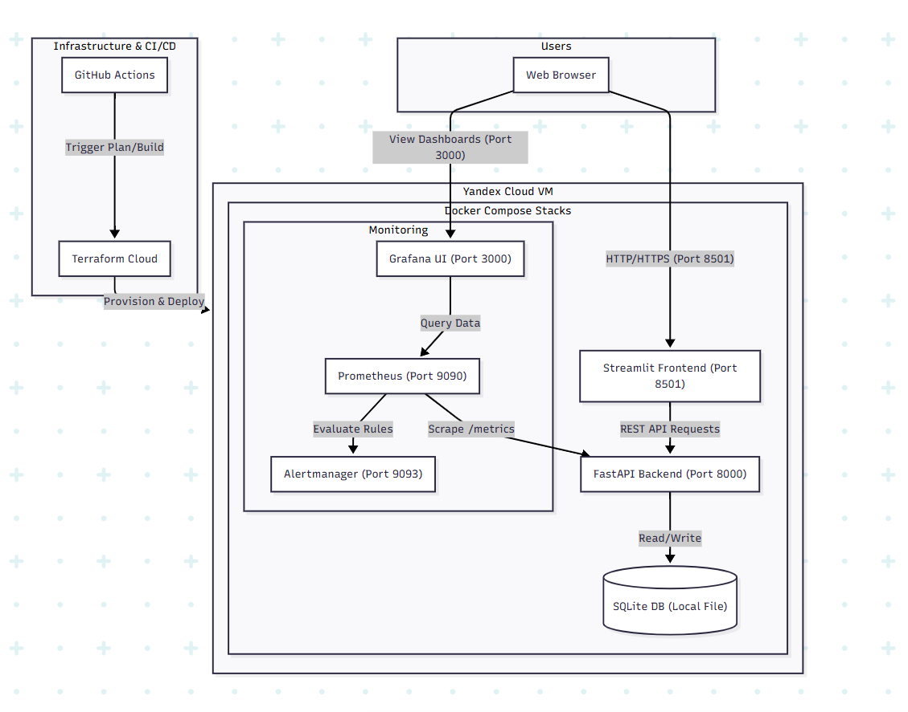
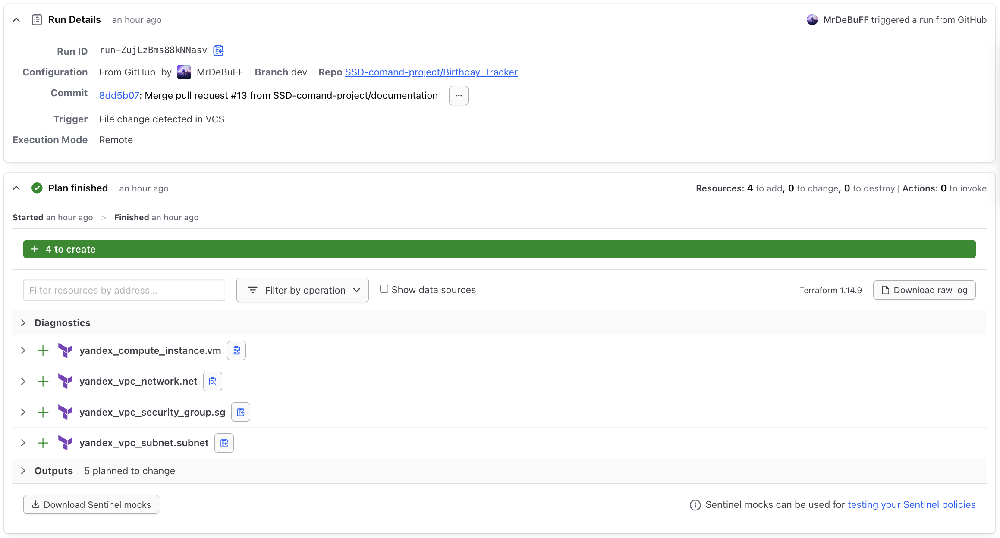
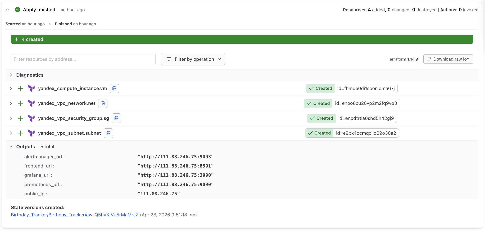
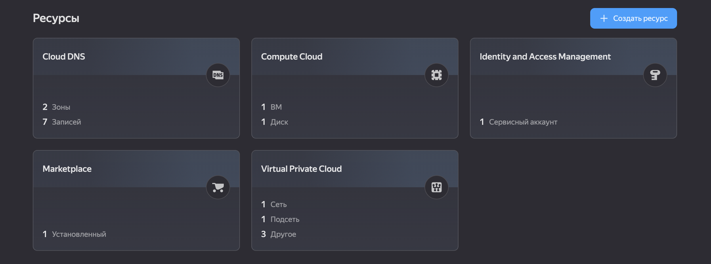

# Company Birthday Tracker

A secure Internal service for tracking employee birthdays, featuring a Streamlit web interface and a FastAPI backend with integrated monitoring and automated IaC deployment.

## Team
- Sofia Palkina (s.palkina@innopolis.university)
- Amir Bairamov (a.bairamov@innopolis.university)
- Polina Kostikova (p.kostikova@innopolis.university)

## Project Access Points (Cloud)

- **Web Application:** [http://birthday-tracker.duckdns.org:8501](http://birthday-tracker.duckdns.org:8501/)
- **API Docs (Swagger):** [http://birthday-tracker.duckdns.org:8000/docs](http://birthday-tracker.duckdns.org:8000/docs)
- **Grafana Dashboards:** [http://birthday-tracker.duckdns.org:3000](http://birthday-tracker.duckdns.org:3000/)
- **Monitoring Tools:** [Prometheus (9090)](http://birthday-tracker.duckdns.org:9090/) | [Alertmanager (9093)](http://birthday-tracker.duckdns.org:9093/)

---
## 1. Introduction (Goal & Scope)

The primary goal of this project is to implement a **Secure Infrastructure-as-Code (IaC) lifecycle** and a robust **Observability stack** for a cloud-native environment. Using an internal "Birthday Tracker" application as a pilot workload, the project demonstrates:

- **Automated IaC Governance:** Implementing a CI/CD pipeline that enforces security standards through automated scanning of Terraform configurations.
- **Shift-Left Security:** Integrating static analysis tools into the development workflow to detect infrastructure misconfigurations and code vulnerabilities before they reach production.
- **Comprehensive Observability:** Establishing a real-time monitoring and alerting framework to provide visibility into system health, performance (SLIs), and saturation.
- **Secure Cloud Provisioning:** Utilizing **Terraform Cloud** for state management and automated deployment to **Yandex Cloud**, ensuring sensitive data and secrets are managed outside of version control.
- **Service Assurance:** Verifying the reliability of the deployed environment through proactive health checks and automated metric collection.

---

## 2. Methods (Architecture & Implementation)

### 2.1 System Architecture
The application follows a microservices-inspired architecture deployed via Docker Compose on Yandex Cloud.


### 2.2 Automated IaC Workflow
- **Infrastructure Provider:** [Yandex Cloud](infra/providers.tf) managed via [Terraform](infra/).
- **Deployment Automation:** Integrated with **Terraform Cloud** for state management and execution. Merges to the `main` branch trigger automated infrastructure updates.
- **Continuous Integration (GitHub Actions):** Every Pull Request undergoes a rigorous "Security Gate" before it can be merged.

### 2.3 Security Tooling (The "Security Gate")
We implemented a multi-layered scanning approach in our [.github/workflows/ci.yml](.github/workflows/ci.yml):
1. **Checkov:** Scans Terraform files for security misconfigurations (e.g., public IP exposure, missing encryption).
2. **TFLint** Validates provider-specific best practices and potential errors.
3. **Terraform fmt:** Ensures consistent code style and readability across all Infra files.
4. **Bandit:** Scans the Python backend for security vulnerabilities (injection, weak crypto).

### 2.4 Tech Stack
- **Backend:** FastAPI with SQLite.
- **Frontend:** Streamlit.
- **IaC:** Terraform Cloudmanaging Yandex Cloud Compute instances.
- **Observability:** Prometheus, Grafana, and Alertmanager.
- **Security:** JWT Authentication, Bandit (code scan), and Checkov (IaC scan).

---

## 3. Results (Implementation & Observability)

### 3.1 Observability Stack Implementation
A comprehensive monitoring solution was deployed to ensure the continuous system reliability and real-time visibility.

- **Metrics Collection:** Prometheus is configured to scrape the FastAPI `/metrics` endpoint every 15s.
- **Visualization:** A custom Grafana Dashboard  tracks key performance indicators:
    - **Availability:** Real-time "Up" status of the backend.
    - **Traffic & Errors:** HTTP request rates and 5xx error ratios via PromQL.
    - **Performance:** P95 and P99 latency distribution per API path.
    - **Saturation:** Process-level CPU and Memory (RSS) utilization.
- **Proactive Alerting:** Alertmanager handles critical alerts defined in alerts.yml, such as `BackendDown` or `High5xxRate`.

### 3.2 Infrastructure Security Validation
Using **Checkov** and **TFLint**, we identified and managed infrastructure risks within the IaC pipeline:
- **Risk Mitigation:** Checkov ensured that security groups only open required ports (8000, 8501, 3000, 9090) and validated that no administrative ports are globally exposed except restricted SSH.
- **Hardened Secrets:** Sensitive data like `SECRET_KEY` and `GF_SECURITY_ADMIN_PASSWORD` are **never stored in git**. They are managed as **Sensitive Variables** in Terraform Cloud and injected into the [VM metadata](infra/vm.tf) at runtime.

### 3.3 CI/CD & Quality Assurance
- **Security Gates:** 100% of merged PRs passed `terraform fmt`, `tflint`, and `checkov` scans. Python code is verified by `Bandit` for security vulnerabilities.
- **Deployment Speed:** Automated deployment from code change to live cloud environment (Terraform Cloud + Yandex Cloud) takes less than 5 minutes.
- **Code Standards:** Linting via Flake8 and testing via Pytest ensure the maintainability of the application logic.

### 3.4 Functional Capabilities (App MVP)
While the focus remains on infrastructure, the deployed application provides:
- **Secure Auth:** JWT-based authentication with bcrypt password hashing.
- **Data Lifecycle:** Full CRUD for employee profiles with automated SQLite persistence via Docker volumes.
- **Discovery:** Real-time search by full name and filtered views for upcoming birthdays.

### 3.5 Infrastructure Management
After creating Merge Request (MR) in `main` branch, the CI/CD pipeline trigger a Terraform Cloud. During the ckecks, Terraform Cloud start `terraform plan`.



After the successful `terraform plan` and after succesful merge in `main` branch, Terraform Cloud start `terraform apply`, which creates infrastructure in Yandex Cloud.



Created infrastructure in Yandex Cloud:



---
## 4. Discussion (Architecture & Evolution)

### 4.1 Architectural Choices
- **Data Persistence:** SQLite was chosen for the MVP to ensure high portability and zero-dependency deployment. The architecture is ready for a seamless migration to a multi-node DB as the user base grows.
- **Pluggable Alerting:** Alertmanager is currently using a `noop` receiver for demonstration. The pipeline is designed to be "pluggable," allowing instant integration with Slack or Email without core logic changes.
- **Metric-Driven Observability:** By focusing on Prometheus metrics, we achieved high visibility into system health (SLIs/SLOs) while maintaining a minimal resource footprint on the cloud instance.

### 4.2 Security Posture
- **Shift-Left Security:** Integration of **Checkov** and **Bandit** into the CI pipeline ensures that infrastructure and code vulnerabilities are detected before deployment. This forms a solid foundation for future DAST implementation.

### 4.3 Strategic Roadmap
- **Scalability:** Migrate to **Managed PostgreSQL** for high availability and automated backups.
- **Access Control:** Implement **RBAC** and OAuth2/SSO integration to meet corporate security standards.
- **Auto-Remediation:** Enhance the monitoring stack to trigger automated service recovery via custom webhooks.
- **Secret Shielding:** Transition to **HashiCorp Vault** or Yandex Lockbox for dynamic secret rotation.
---

## Developer Guide

### 1. Requirements
- Python 3.10+ (recommended: 3.12)
- [Poetry](https://python-poetry.org/)
- Docker & Docker Compose

### 2. Setup and Installation
```bash
# Install dependencies
poetry install

# (Optional) Manually initialize database (usually not needed)
poetry run python scripts/init_db.py

# Install pre-commit hooks
poetry run pre-commit install
```
> The database is automatically initialized on backend startup (both locally and in Docker)

### 3. Running Locally

**Windows (PowerShell):**
```powershell
$env:GF_SECURITY_ADMIN_PASSWORD="your_secure_password"
$env:SECRET_KEY="your_long_random_jwt_secret"
docker compose up -d --build
```

**Linux / macOS:**
```bash
export GF_SECURITY_ADMIN_PASSWORD="your_secure_password"
export SECRET_KEY="your_long_random_jwt_secret"
docker compose up -d --build
```

> In production (Terraform Cloud), these credentials are set via **Sensitive Environment Variables** in the workspace settings.  Please contact our team to obtain the Grafana access password.


---
